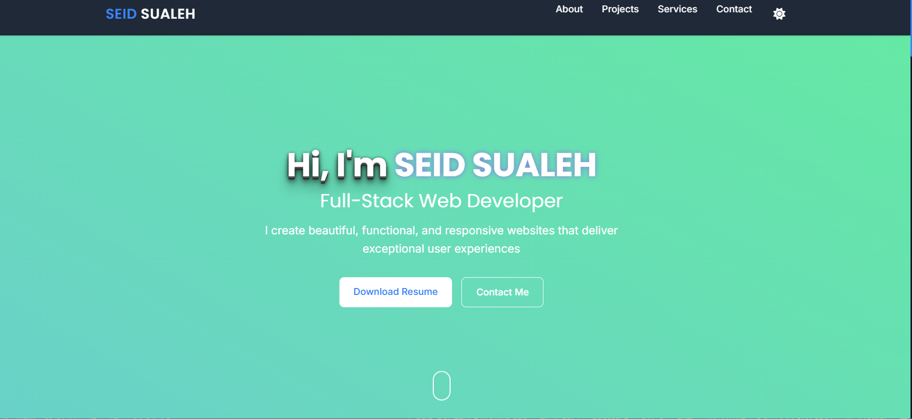

# 🌐 Seid Sualeh Portfolio

 

Welcome to my personal **portfolio website**!  
I built this portfolio to showcase my skills, projects, and certifications as a **Junior Full-Stack Web Developer**.  
The website is fully responsive, modern, and optimized for both desktop and mobile devices.

---

## 🚀 Live Demo
🔗 **[Visit Portfolio](https://seidsualeh.netlify.app/)** 

---

## ✨ Features
✅ Responsive design with modern UI  
✅ Built using **HTML, CSS, javascript**  
✅ Showcases my **skills, projects, certifications, and contact details**  
✅ Easy navigation with smooth scrolling  
✅ Optimized for performance and SEO

---

## 🛠️ Tech Stack
- **Frontend:** HTML5, CSS3, Bootstrap, TailwindCSS,React,JavaScript
-  **Backend:** Node.js, MYSQL,PHP , Express.js
- **Version Control:** Git & GitHub
- **Deployment:** GitHub Pages

---

## 📂 Folder Structure
root
├── index.html
├── css
│── images
│── javascript
└── README.md

---

## 📧 Contact
💼 **LinkedIn:** [Seid Sualeh](https://www.linkedin.com/in/seid-sualeh)  
💻 **GitHub:** [Seid-Sualeh](https://github.com/Seid-Sualeh)  
🌐 **Portfolio:** [seidsualeh.netlify.app](https://seidsualeh.netlify.app)  
           
📧 **Email:** plshireseid@gmail.com  

---

## 🤝 Contributing
Want to suggest improvements or report bugs?  
Feel free to open an **issue** or submit a **pull request**!

---

⭐ **If you like this project, don’t forget to star the repo!**

