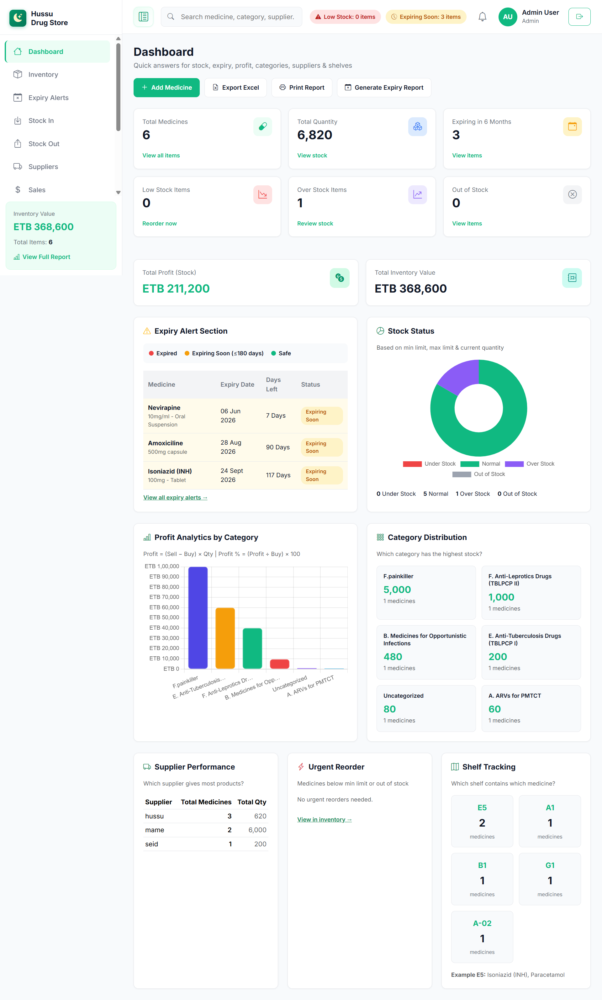
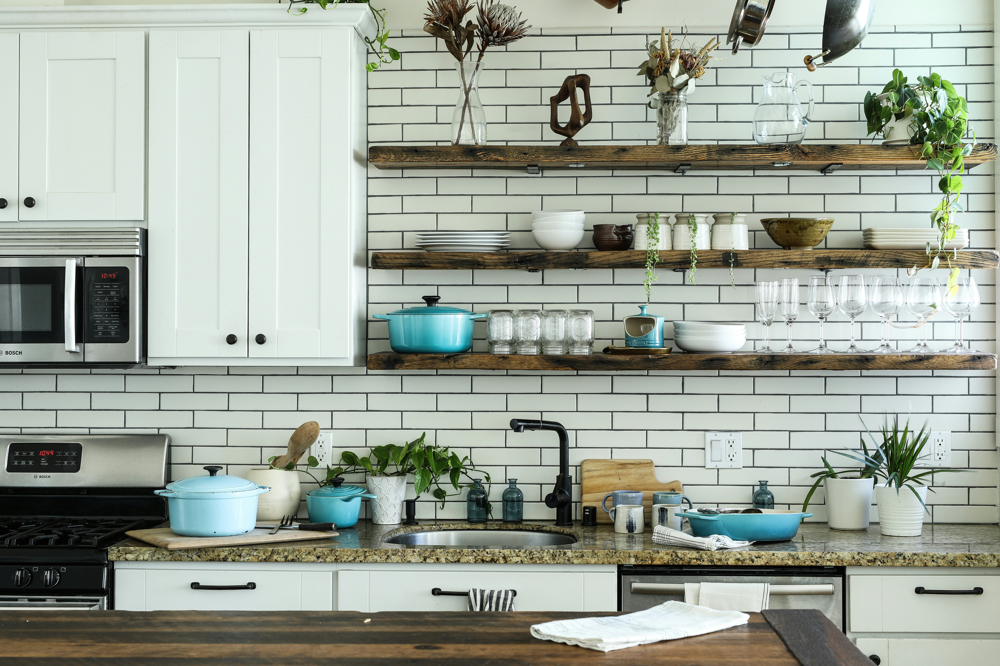
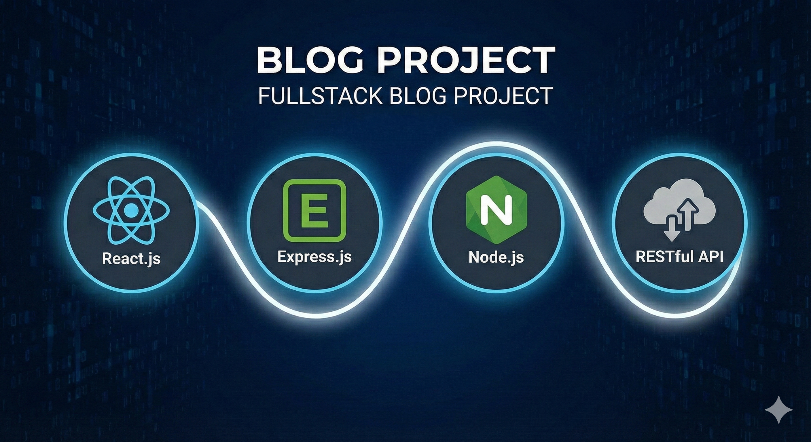
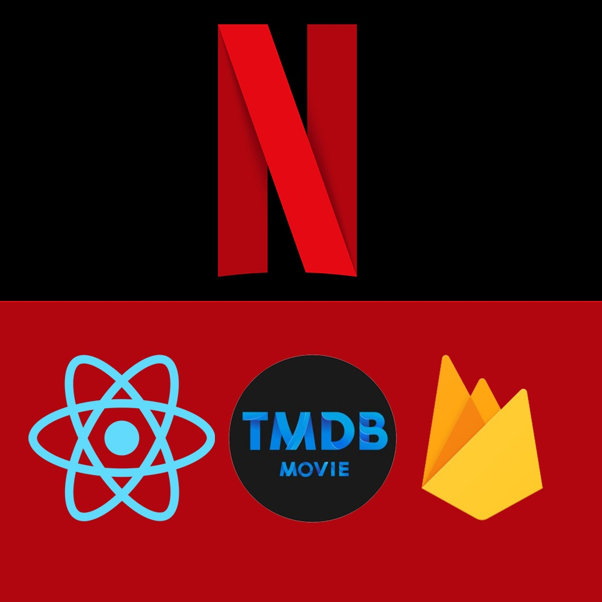
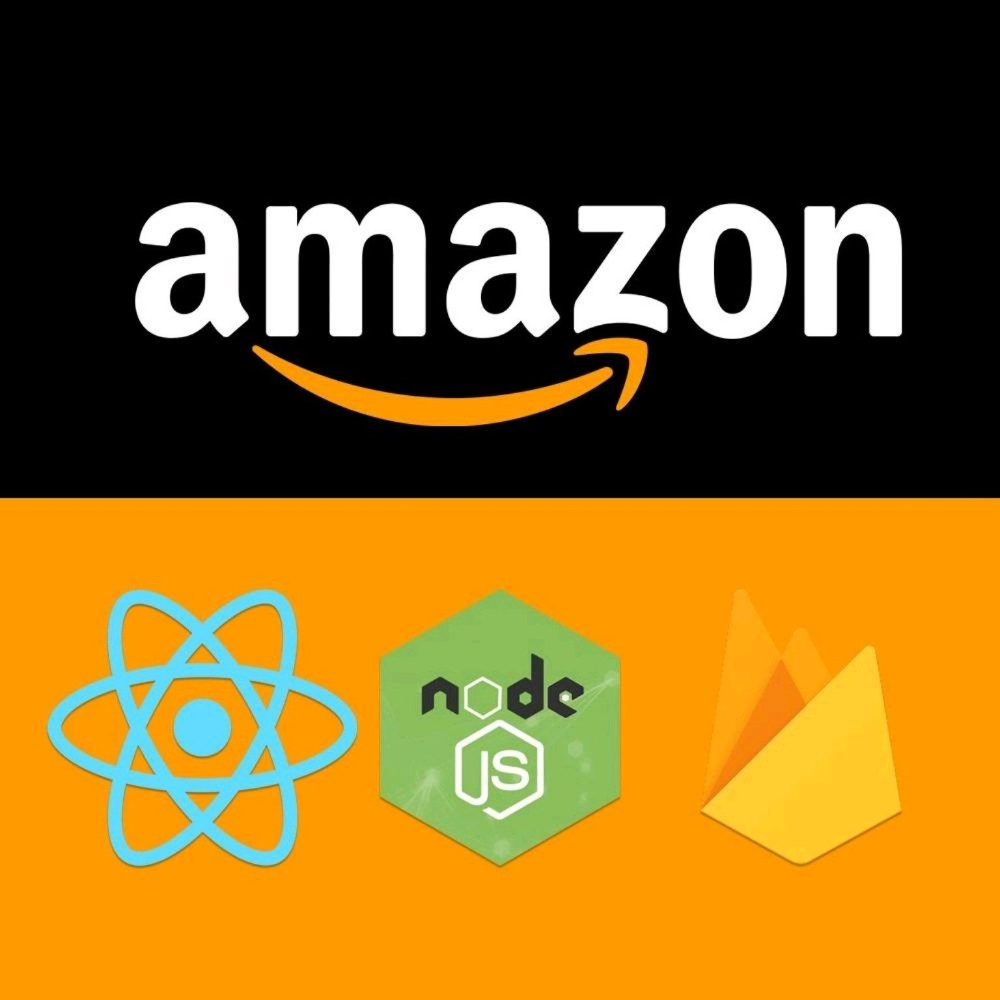
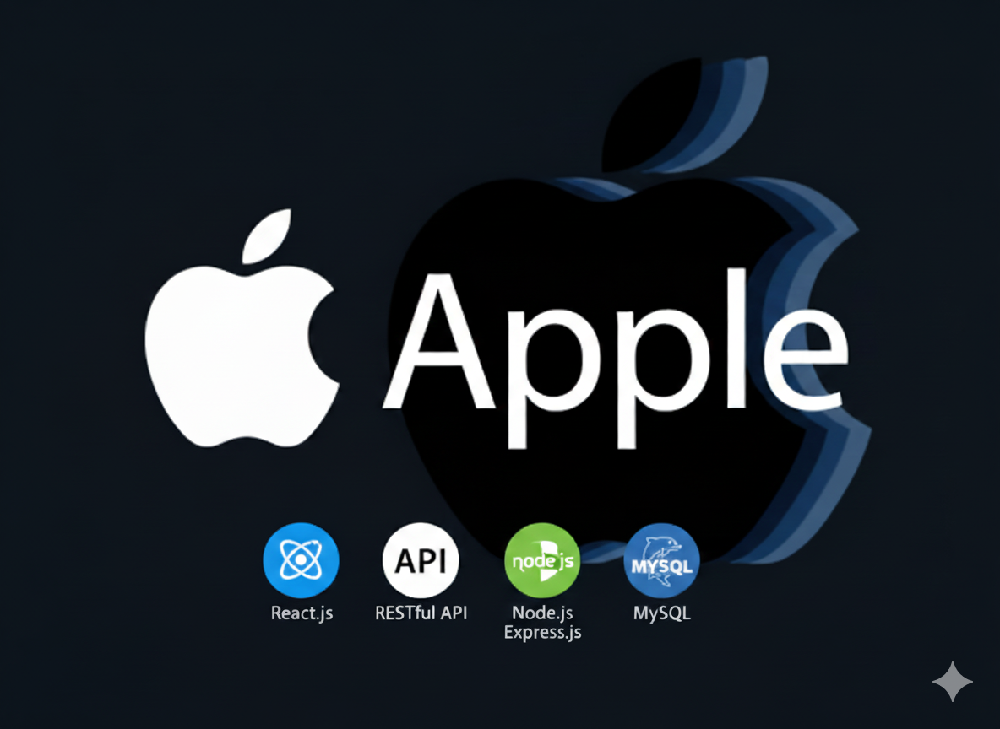
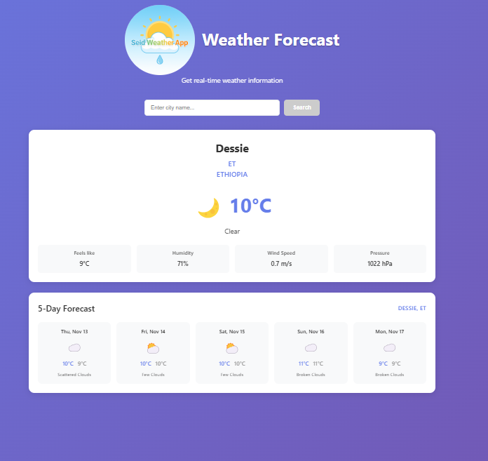

# Seid Sualeh - Full-Stack Developer Portfolio

<div align="center">

[](https://seid-portfolio-xi.vercel.app/)
[](https://www.linkedin.com/in/seid-sualih-92b938370/)
[](https://github.com/Seid-Sualeh)
[](mailto:Plshireseid@gmail.com)


</div>

---

## 👨‍💻 About The Redesign

This repository hosts the source code for the premium, modern, and professional portfolio of **Seid Sualeh**. Built with top-tier SaaS design aesthetics, it demonstrates state-of-the-art UI/UX, seamless transitions, and clean frontend architecture designed to command immediate trust with recruiters and clients.

### ✨ Premium Features Highlights:
- **🎨 Modern Design System**: Built with centralized CSS variables, responsive typography using **Space Grotesk** and **Inter**, and elegant glassmorphism effects.
- **✨ Code Particle Background Engine**: Includes a custom, performance-friendly HTML5 Canvas particle engine rendering floating monospace developer tokens (`< />`, `=>`, `{}`) reacting to screen bounds.
- **📈 Recruiter-Focused Positioning**: Features an availability status indicator and a credibility stats bar (`11+ Projects Shipped`, `Open to Work`) to build immediate confidence.
- **⏱️ Alternating Vertical Timelines**: Transforms the Education and Experience sections into clean timeline grids with color-coded status pills (`Completed`, `In Progress`) and scroll-triggered fade animations.
- **🗂️ Project Filtering**: Supports instant client-side tag filtering (All, Full-Stack, Frontend) for all showcase items.

---

## 👨‍💻 About Me

I'm a **Full-Stack Web Developer** with a unique background bridging healthcare analytics and modern software engineering. Based in Addis Ababa, Ethiopia, I specialize in building fast, beautiful, and scalable web applications using the MERN stack and relational databases.

My prior experience as a Medical Laboratory Technologist at Bati Primary Hospital cultivates a rigorous attention to detail, diagnostic data analysis, and process optimization that directly translates into building robust backend architectures and clean, reliable codebases.

---

## 🛠️ Technical Skills

### **Frontend Development**

<div align="left">


</div>

### **Backend Development**

<div align="left">


</div>

### **Tools & Technologies**

<div align="left">


</div>

---

## 🚀 Featured Projects

### **1. Hussu Drug Store**

<p>
  <a href="https://hussu-drug-store.vercel.app/" target="_blank" rel="noopener noreferrer">
    
  </a>
</p>

*Full-stack pharmacy inventory and management system* 

- **Technologies**: React, Node.js, Express, MySQL
- **Features**: Live sales dashboard, stock levels tracking, supplier directory, and role-based access control.
- **Live Demo**: [View Project](https://hussu-drug-store.vercel.app/)
- **GitHub**: [View Code](https://github.com/Seid-Sualeh/Hussu-Drug-Store)

### **2. Brother's Kitchenware**

<p>
  <a href="https://brothers-kitchenware.netlify.app" target="_blank" rel="noopener noreferrer">
    
  </a>
</p>

*Premium responsive E-Commerce platform*

- **Technologies**: React, Node.js, Express, MySQL
- **Features**: Product catalog filtering, user authentication, customer checkout cart, and multi-language support.
- **Live Demo**: [View Project](https://brothers-kitchenware.netlify.app)
- **GitHub**: [View Code](https://github.com/Seid-Sualeh/Brothers-Kitchenware)

### **3. Evangadi Forum**

<p>
  <a href="https://seidforum.vercel.app" target="_blank" rel="noopener noreferrer">
    
  </a>
</p>

*AI-integrated learning and discussion forum*

- **Technologies**: React.js, Node.js, MySQL, OpenAI API
- **Features**: Secure JWT authentication, QA posts, and AI-powered recommendations for supplementary study resources.
- **Live Demo**: [View Project](https://seidforum.vercel.app)
- **GitHub**: [View Code](https://github.com/Seid-Sualeh/Evangadi_Forum_Front-end)

### **4. Abe Garage**

<p>
  <a href="https://seid-abe-garage.netlify.app" target="_blank" rel="noopener noreferrer">
    
  </a>
</p>

*Service management system for automotive repair*

- **Technologies**: React.js, Node.js, Express.js, MySQL
- **Features**: Vehicle tracking, service scheduling, and maintenance logs.
- **Live Demo**: [View Project](https://seid-abe-garage.netlify.app)
- **GitHub**: [View Code](https://github.com/Seid-Sualeh/Abe-Garage-Project)

---

<div align="center">

### 📸 Project Gallery

<p>
   <a href="https://hussu-drug-store.vercel.app/" target="_blank" rel="noopener noreferrer">
      
   </a>
   <a href="https://brothers-kitchenware.netlify.app" target="_blank" rel="noopener noreferrer">
      
   </a>
   <a href="https://seid-abe-garage.netlify.app" target="_blank" rel="noopener noreferrer">
      
   </a>
   <a href="https://seidforum.vercel.app" target="_blank" rel="noopener noreferrer">
      
   </a>
   <a href="https://seid-blog-app.vercel.app/" target="_blank" rel="noopener noreferrer">
      
   </a>
</p>
<p>
   <a href="https://seidnetflix.vercel.app/" target="_blank" rel="noopener noreferrer">
      
   </a>
   <a href="https://seidamazoneclone.vercel.app/" target="_blank" rel="noopener noreferrer">
      
   </a>
   <a href="https://seidappleclone.vercel.app/" target="_blank" rel="noopener noreferrer">
      
   </a>
   <a href="https://seid-image-generator-website.vercel.app/" target="_blank" rel="noopener noreferrer">
      
   </a>
   <a href="https://seid-weather-app.vercel.app/" target="_blank" rel="noopener noreferrer">
      
   </a>
</p>

<p style="margin-top:8px;font-size:14px;color:#6b7280">Click any thumbnail to open the live demo in a new tab.</p>

</div>

---

## 🎓 Education & Certifications

- **Full-Stack Web Development** | *Evangadi Tech Scholarship Program* (2025)
- **Medical Laboratory Science (BSc)** | *Wollo University* (2016-2021)
- **MERN Stack & AI Integration** | *O'Reilly Media* (Ongoing)
- **Full-Stack Development Track** | *Gebeya Talent Academy* (Ongoing)
- **Cloud Computing & Web Development** | *Safaricom Talent Cloud* (Ongoing)

---

## 💼 Professional Experience

### **Full-Stack Web Developer** | *Freelance & Personal Projects* (2025 - Present)
- Shipped 11+ full-stack web applications with optimized frontend and REST APIs.

### **Web Development Trainee** | *Evangadi Tech Scholarship Program* (2025)
- Mastered full-stack engineering and team Git/GitHub workflows.

### **Medical Laboratory Technologist** | *Bati Primary Hospital* (2021 - Present)
- Performed diagnostic laboratory analytics, systematic data entries, and process optimizations.

---

## 🚀 Getting Started

### **Prerequisites**
- Node.js (version 18 or higher)
- npm or yarn

### **Installation & Setup**
1. **Clone the repository**
   ```bash
   git clone https://github.com/Seid-Sualeh/Seid-Portfolio.git
   cd Seid-Portfolio/seid
   ```

2. **Install dependencies**
   ```bash
   npm install
   ```

3. **Start the development server**
   ```bash
   npm run dev
   ```

4. **Build for production**
   ```bash
   npm run build
   ```

---

## 📂 Directory Structure
```
Seid-Portfolio/
├── README.md               # Main repository documentation
├── seid/
│   ├── index.html          # Main HTML5 entry point
│   ├── package.json        # Dependencies & scripts
│   ├── assets/             # Media assets & resume PDF
│   │   ├── image/         # Profile & project snapshots
│   │   └── pdf/           # Resume download files
│   └── src/
│       ├── App.css        # Global design system variables & utility classes
│       ├── App.jsx        # App component
│       ├── components/    # Overhauled components (header, hero, timelines...)
│       └── pages/         # Page templates
```

---

## 📱 Contact Information

<div align="center">

**Let's build something amazing together!**

[](https://www.linkedin.com/in/seid-sualih-92b938370/)
[](mailto:Plshireseid@gmail.com)
[](https://github.com/Seid-Sualeh)
[](tel:+251929075365)

**Location**: Addis Ababa, Ethiopia  
**Availability**: Open to full-time remote developer positions, freelance contracts, and software engineering internships.

</div>

---

<div align="center">

_Built with ❤️ by Seid Sualeh_

</div>
